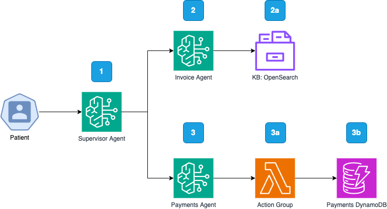

# Multi-Agents for Assisting Patients with Questions and Payments

Multi-agent AI systems consist of multiple autonomous AI agents that interact, collaborate, or compete to achieve individual or shared goals. Multi-agents were announced on AWS Bedrock on Dec 3rd, 2024 ([Introducing multi-agent collaboration capability for Amazon Bedrock (preview)](https://aws.amazon.com/blogs/aws/introducing-multi-agent-collaboration-capability-for-amazon-bedrock/)). In this project, I showcase how to use a multi-agent system to assist patients in a dental insurance scenario.

Adapted from [AWS Samples: Creating Agent with Knowledge Base and an Action Group connection](https://github.com/aws-samples/amazon-bedrock-samples/tree/main/agents-and-function-calling/bedrock-agents/features-examples/05-create-agent-with-knowledge-base-and-action-group)


# Multi-Agent Architecture



In this setup, we have a supervisor agent that is working with the patient and routing requests to collaborating agents that specialize in invoicing and payments. The goal of the supervisor agent is to understand patient intent and gather key information from the patient that are required for collaboration agents to perform their tasks.

The Invoice Agent is in charge of looking up historical information like past invoices and what dental services are available. To enable the agent to be aware of this context we attach a knowledge base with OpenSearch that is ingested with invoice and glossary data. To prevent patients from accessing invoices that is not their own, the agent is only allowed to search invoices of that patient. 

The Payments Agent is in charge of setting up payment schedule for the patient. This agent has access to Lambda action groups and DynamoDB to create records for downstream systems. 

### Sequence

1. Supervisor fields requests from Patient
2. Invoice Agent retrieves information from Knowledge Base (2a)
3. Payments Agent creates payment schedule using Action Group (3a) to update Payments DynamoDB (3b)


# Design Concepts

Key consideration: simpler models for lower cost and maintainability

It is possible to engineer a more sophisticated agent that can do both the task of invoice and payments. However, a more intelligent agent will require a more powerful LLM and more expense. Having specialization in agents enables us to use smaller LLMs that are faster and cheaper. Furthermore, the system will be more modular, allowing us to troubleshoot and improve different components of the system.

In our setup, the specialized collaboration agents are using Anthropic Haiku, which is 12x cheaper than the supervisor agent using Anthropic Sonnet.

# DEMO

Example Prompts and Responses

## Invoice Agent

```
User: What are dental procedures for prevention?

Agent: Dental procedures for prevention include:
- Prophylaxis (dental cleaning) for adults and children to remove plaque and tartar (D1110, D1120)
- Topical application of fluoride varnish to strengthen teeth and prevent cavities (D1206)
- Dental sealants applied to the chewing surfaces of teeth to protect against decay (D1351)
```

```
User: I am Gordon Moore. What is on my invoice?

Agent: According to the search results, your invoice shows that you had a Routine Dental Checkup on 1/10/2025 and 1/12/2025, for a total of 10 units at $25 per unit, resulting in a total charge of $250.
```

## Payments Agent

```
User: My name is Grace Hopper and I want to create a payment schedule.

Agent: To set up a payment schedule for you, Grace, I will need the following information:

- The date of your dental appointment or procedure
- Your insurance ID number
- The invoice ID for the payment you need to make

Once I have those details, I can create a payment schedule for you. Please provide that information and I'll be happy to assist you further.
```
```
User: My name is Grace Hopper and I want to create a payment schedule on 5th of May 2025. My insurance ID is HELLO123. Invoice ID is 332211

Agent: Thank you for providing the necessary information. I have successfully created a new payment schedule for you on May 5, 2025 with the invoice ID 332211 and your insurance ID HELLO123. The payment ID is 332211. Please let me know if you need any other assistance.
```

## Supervisor Agent
```
User: hello

Agent: Hello, could you please provide your name and Patient ID so I can verify your identity before proceeding?

User: My name is Gordon Moore. ID is MEM43

Agent: Thank you for providing your details, Gordon. How can I assist you today? Do you need help checking available dental services or scheduling a payment?

User: I need help checking available dental services under preventative care

Agent: Gordon, based on the information from our insurance provider, the following preventative dental services are covered under your plan:

    Routine dental cleanings and prophylaxis for adults (D1110) and children (D1120)
    Topical application of fluoride varnish (D1206)
    Dental sealants applied to teeth (D1351)

Please let me know if you need any other assistance regarding these preventative services.

User: Do I have any invoices?

Agent: Gordon, here are the details based on the information provided:

Regarding available preventative dental care services, some key services covered include routine dental cleanings (prophylaxis) for adults and children, topical fluoride varnish application, and dental sealants.

As for your outstanding invoices, you currently have two open invoices:

    Invoice #20073991 dated 2/13/2025 for a routine dental checkup with a total of $50.00.
    Invoice #20073001 dated 1/13/2025 for a routine dental checkup with a total of $200.00.

Please let me know if you need any clarification or have additional questions!

User: I want to create a payment schedule for these two invoices on april 13th, 2025

Agent: Gordon, I have the following confirmation regarding your payment schedule request:

A payment schedule has been successfully set up for your two outstanding dental invoices on April 13th, 2025:

    Invoice #20073991 dated 2/13/2025 for $50.00
    Invoice #20073001 dated 1/13/2025 for $200.00

The total amount due on April 13th, 2025 will be $250.00 to cover both invoices.

Please let me know if you need any other assistance related to your dental services or payments.

User: thank you. that's all the help I needed

Agent: You're welcome Gordon! I'm glad I could assist you with checking the available preventative dental care services covered under your plan, providing details on your outstanding invoices, and setting up the payment schedule for April 13th, 2025. Thank you for reaching out, and please feel free to contact us again if you have any other questions or needs regarding your dental services and payments.
```

# Improvement Areas

What are some areas of improvement?

1. Create automated testing and evaluation for agents - for faster, more reliable model update lifecycle.
2. Clean and ingest invoices into a database using batch inference or data automation - increased speed and reduce cost
3. Few shot prompting for agents - better training, smarter, more consistent behavior
4. Improved prompt engineering to reduce security and privacy risks - protection from bad actors

